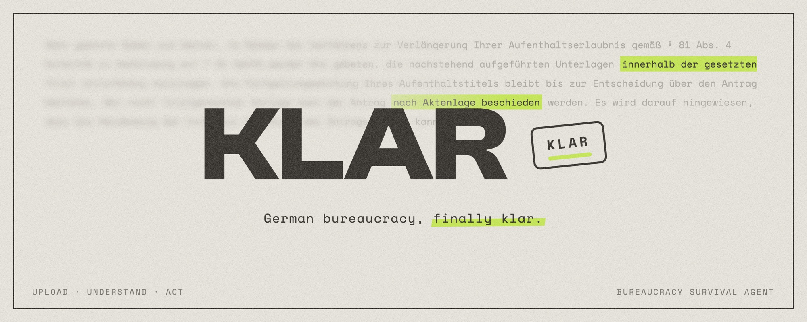
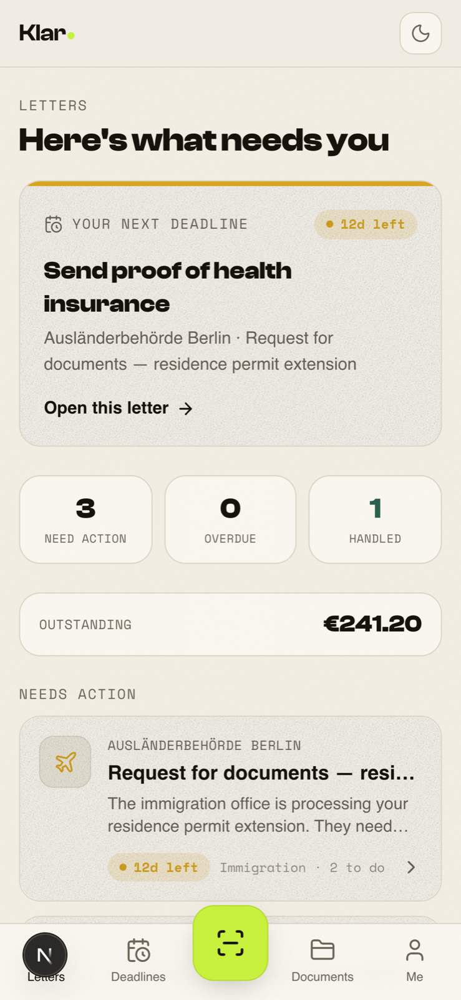
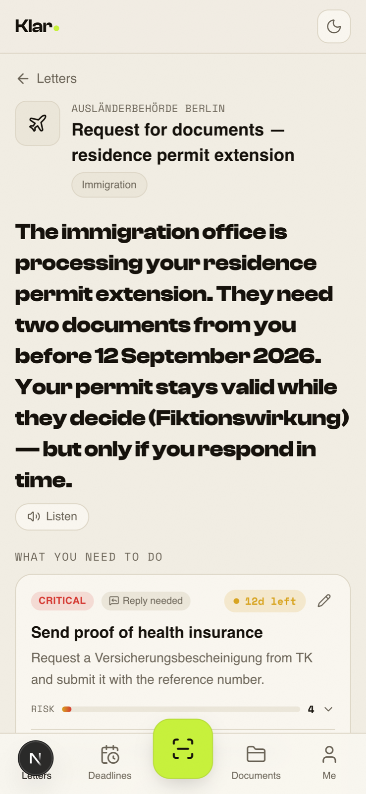
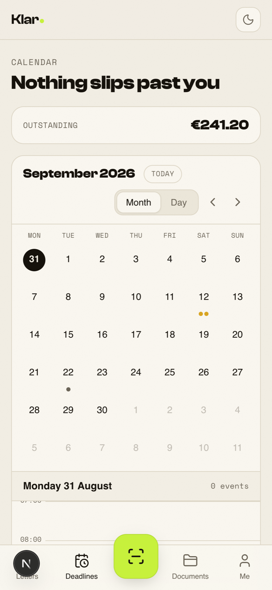
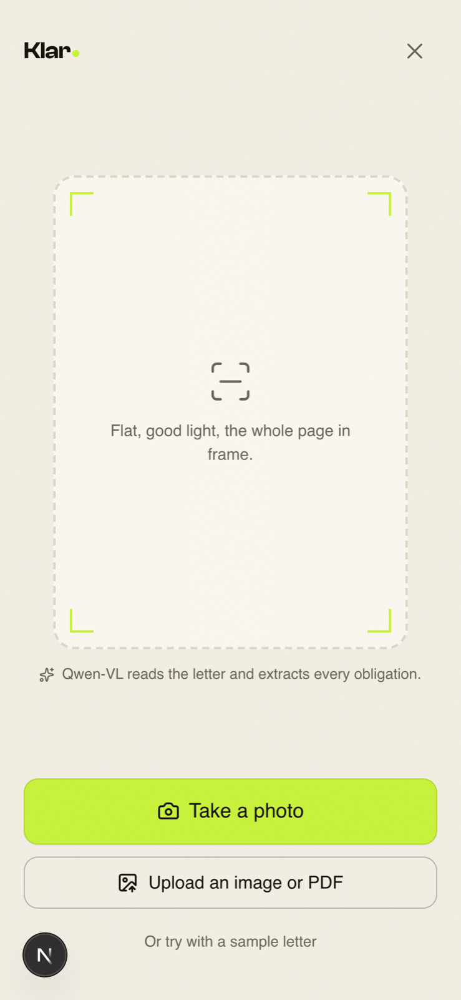
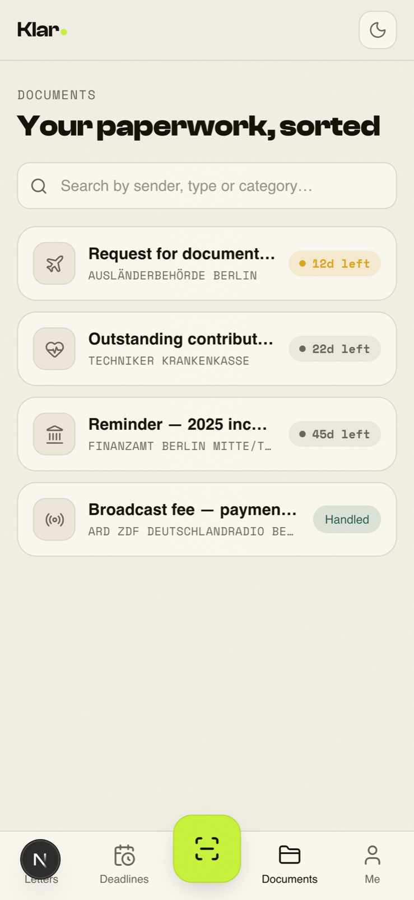
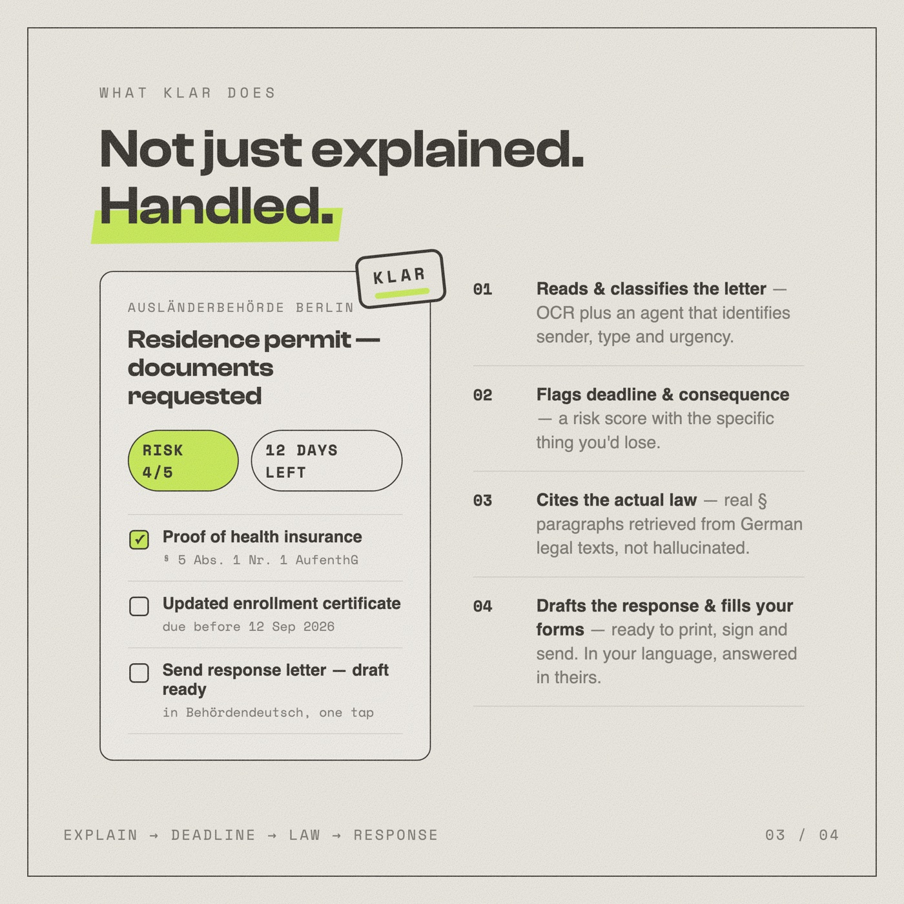
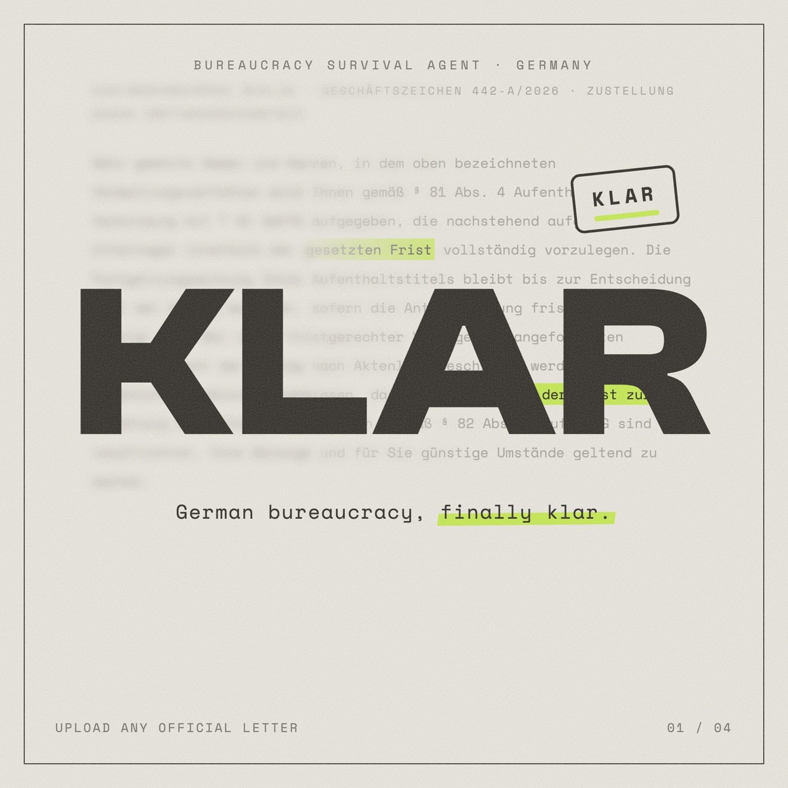
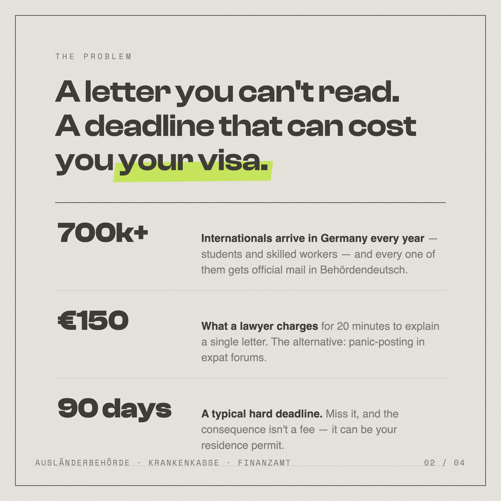
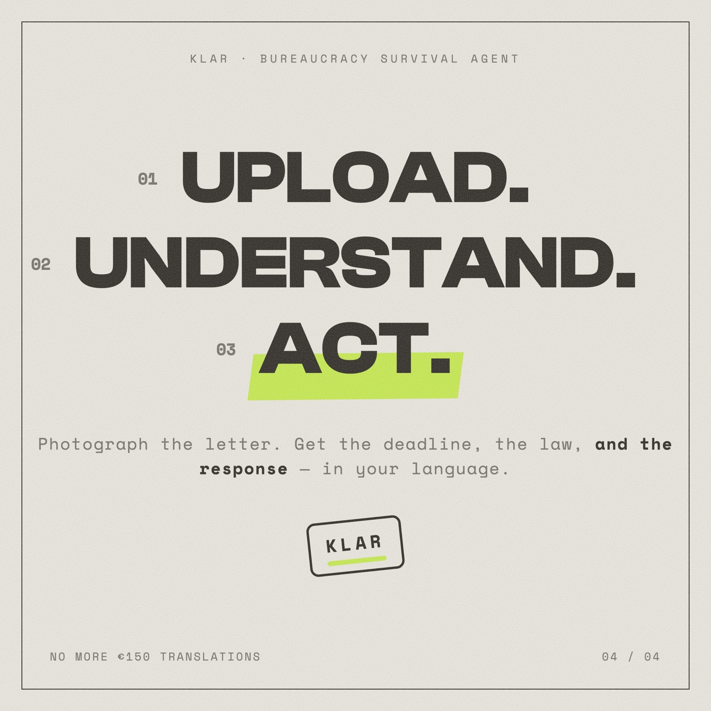

<p align="center">
  
</p>

# Klar

**German bureaucracy, finally _klar_.**

Upload any official German letter. Klar reads it, explains what it means, scores the risk, drafts your response in Behördendeutsch, fills your forms, and answers your follow-up questions — grounded in actual German law.

Built at the [AI BEAVERS Founder Hackathon](https://luma.com/hmqh70k1), Hamburg, June 6 2026.

---

## The app

<table>
  <tr>
    <td align="center"></td>
    <td align="center"></td>
    <td align="center"></td>
  </tr>
  <tr>
    <td align="center"><b>Home</b> — your next deadline, what needs action, what's outstanding</td>
    <td align="center"><b>Letter detail</b> — the summary in your language, every obligation with risk & evidence</td>
    <td align="center"><b>Calendar</b> — every deadline from every letter, in one place</td>
  </tr>
  <tr>
    <td align="center"></td>
    <td align="center"></td>
    <td align="center"></td>
  </tr>
  <tr>
    <td align="center"><b>Scan</b> — photograph the letter; Qwen-VL extracts every obligation</td>
    <td align="center"><b>Archive</b> — searchable history of everything the Amt ever sent you</td>
    <td align="center"><b>The wedge</b> — not just explained. Handled.</td>
  </tr>
</table>

> Screenshots are real captures of the running app (installable mobile-first PWA, light/dark, six languages including RTL).

---

## Features

| Feature | What it does |
|---------|-------------|
| **OCR** | Qwen-VL-OCR extracts every word from photographed or scanned letters |
| **Classification & Risk** | LangGraph ReAct agent classifies the letter type, extracts deadlines, scores risk 1-5 with specific consequences |
| **Legal grounding (RAG)** | ChromaDB corpus of 13 German laws / 1,488 paragraphs. Every citation is retrieved, never hallucinated |
| **Explanation** | Plain-language breakdown in your language (EN, DE, FA, TR, AR, UK) |
| **Response draft** | Ready-to-send reply in Behördendeutsch with document checklist |
| **Form fill** | Downloads the original letter with English placeholder text on blank fields — print and fill |
| **Follow-up chat** | Ask questions about your specific letter; answers grounded in the letter context + legal refs |
| **Deadline tracking** | Calendar view of all obligations sorted by urgency |

## Architecture

```
Image/PDF  ──→  Qwen-VL-OCR  ──→  LangGraph ReAct Agent (Qwen 3.7 + Tavily)
                                          │
                                    classification, risk,
                                    deadline, consequence
                                          │
                    ┌─────────────────────┼─────────────────────┐
                    ▼                     ▼                     ▼
              ChromaDB RAG        Response Generator      Form Fill
            (13 German laws)     (anti-hallucination)    (Qwen Image Edit)
                    │                     │                     │
                    ▼                     ▼                     ▼
              § citations          Behördendeutsch        Annotated image
              + explanation         reply draft           with placeholders
```

## Tech Stack

| Layer | Technology |
|-------|-----------|
| Frontend | Next.js 15, React 19, TypeScript, Tailwind v4, Serwist (PWA) |
| Backend | Python, FastAPI, SQLModel, SQLite |
| AI / OCR | Qwen-VL-OCR (DashScope API) |
| AI / Agent | LangGraph, Qwen 3.7-plus, Tavily Search |
| AI / RAG | ChromaDB, Qwen text-embedding-v3 |
| AI / Generation | Qwen 3.7-plus with structured output |
| AI / Form Fill | Qwen Image 2.0 (DashScope image editing) |
| Auth | Cookie-based sessions (httpOnly, bcrypt) |

## Quick Start

### Prerequisites

- Python 3.12+
- Node.js 20+
- `poppler` for PDF support: `brew install poppler` (macOS) / `apt install poppler-utils` (Linux)

### 1. Clone and install

```bash
git clone https://github.com/aircode610/Klar.git
cd Klar

# Backend
python3 -m venv .venv
source .venv/bin/activate
pip install -r backend/requirements.txt
pip install -r ai/requirements.txt

# Frontend
cd frontend
npm install
cp .env.example .env.local
cd ..
```

### 2. Environment variables

**Backend** — create `backend/.env`:

```env
DASHSCOPE_API_KEY=your-qwen-api-key
QWEN_API_BASE=https://dashscope-intl.aliyuncs.com/compatible-mode/v1
QWEN_MODEL=qwen3.7-plus
TAVILY_API_KEY=your-tavily-key
ALLOWED_ORIGINS=http://localhost:3000
COOKIE_SAMESITE=lax
COOKIE_SECURE=false
APP_ENV=dev
```

**Frontend** — `frontend/.env.local`:

```env
NEXT_PUBLIC_API_URL=http://localhost:8000
NEXT_PUBLIC_DEFAULT_LANG=en
```

### 3. Ingest the legal corpus

```bash
source .venv/bin/activate
python ai/rag/ingest.py
```

This embeds 13 German laws (AufenthG, AsylG, EStG, SGB V, etc.) into ChromaDB. Takes ~2 minutes.

### 4. Run

**Terminal 1 — Backend:**

```bash
source .venv/bin/activate
cd backend
uvicorn app.main:app --reload --port 8000
```

**Terminal 2 — Frontend:**

```bash
cd frontend
npm run dev
```

Open [http://localhost:3000](http://localhost:3000). Sign up, upload a letter, see the magic.

## Project Structure

```
Klar/
├── frontend/           # Next.js 15 PWA
│   ├── app/            # App Router pages
│   ├── components/     # UI + brand components
│   ├── lib/            # API client, hooks, store, i18n
│   └── types/          # TypeScript contracts
├── backend/            # FastAPI server
│   └── app/
│       ├── routers/    # /letters, /actions, /chat, /rag, /auth
│       ├── services/   # extraction, persistence, risk scoring
│       ├── models.py   # SQLModel tables
│       └── schemas.py  # Pydantic request/response shapes
├── ai/                 # AI pipeline
│   ├── react_agent/    # LangGraph ReAct agent (classification + risk)
│   ├── rag/            # ChromaDB ingestion + retrieval + generation
│   ├── prompts.py      # All LLM prompts (OCR, agent, generation, chat)
│   ├── schemas.py      # Pydantic structured output models
│   └── form_fill.py    # Qwen image editing for form annotation
├── data/               # Sample test letters
└── docs/               # Specs, plans, pitch brief
```

## API Endpoints

| Method | Path | Description |
|--------|------|-------------|
| `POST` | `/letters` | Upload letter → full extraction (synchronous) |
| `GET` | `/letters/{id}` | Fetch letter with all actions |
| `GET` | `/actions` | List obligations (powers home + calendar) |
| `PATCH` | `/actions/{id}` | Mark done / edit obligation |
| `POST` | `/letters/{id}/reply` | Generate Behördendeutsch reply |
| `POST` | `/letters/{id}/form-fill` | Download annotated form image |
| `POST` | `/chat` | Follow-up Q&A about a specific letter |
| `POST` | `/rag/search` | Search the legal knowledge base |
| `GET` | `/health` | Backend status |

## Legal Corpus (RAG)

13 German laws, 1,488 embedded paragraphs:

| Law | Abbrev | Relevance |
|-----|--------|-----------|
| Aufenthaltsgesetz | AufenthG | Residence permits, visa |
| Aufenthaltsverordnung | AufenthV | Residence procedures |
| Asylgesetz | AsylG | Asylum proceedings |
| Asylbewerberleistungsgesetz | AsylbLG | Asylum seeker benefits |
| Beschäftigungsverordnung | BeschV | Work permits |
| Einkommensteuergesetz | EStG | Income tax |
| Sozialgesetzbuch V | SGB V | Health insurance |
| BAföG | BAföG | Student financial aid |
| Verwaltungsverfahrensgesetz | VwVfG | Administrative procedure |
| Ordnungswidrigkeitengesetz | OWiG | Administrative fines |
| Bundesmeldegesetz | BMG | Registration law |
| Wohngeldgesetz | WoGG | Housing benefit |
| Integrationsverordnung | IntV | Integration courses |

## The story in four slides

<table>
  <tr>
    <td></td>
    <td></td>
  </tr>
  <tr>
    <td></td>
    <td></td>
  </tr>
</table>

## Team

Built by international students who have lived this exact pain — the Ausländerbehörde letter in legal German you can't read, with a 14-day deadline you can't miss.

## License

MIT
